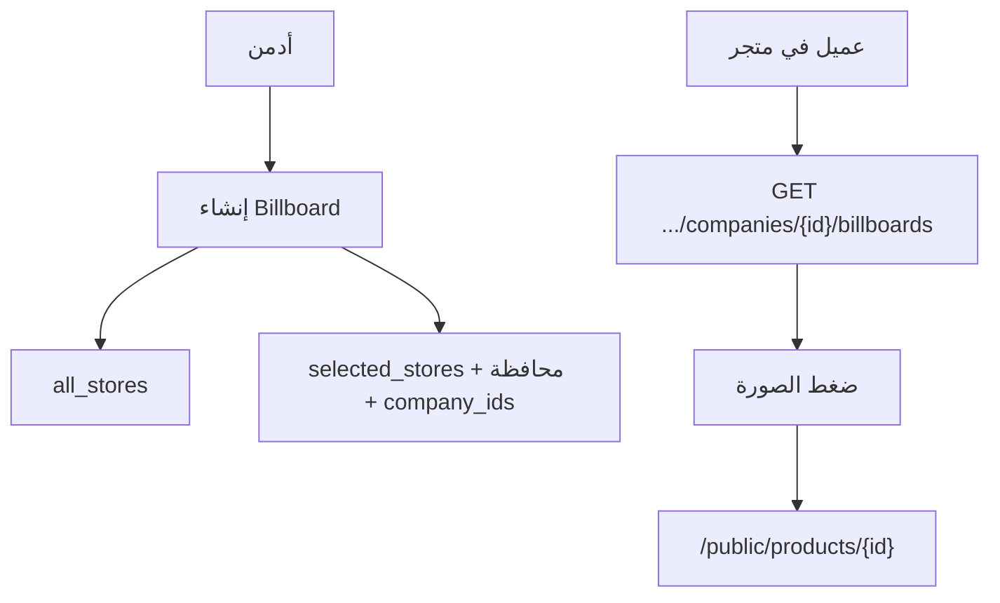

# Watafl — Billboards (إعلانات متاجر الشركات)

الأدمن يرفع صورة إعلانية مربوطة بمنتج مورد. تظهر داخل **متجر الشركة** فقط، والضغط يفتح صفحة منتج واتفل.

**Postman:** [`Watafl_Billboards.postman_collection.json`](../Watafl_Billboards.postman_collection.json)

**Base:** `/api`

---

## الفكرة

| عنصر | وصف |
|------|-----|
| صورة | يرفعها الأدمن (مش صورة المنتج بالضرورة) |
| منتج | `supplier_product` من مورد معيّن |
| استهداف | كل المتاجر **أو** محافظة + متاجر مختارة |
| ظهور | `GET /public/companies/{id}/billboards` |
| ضغط | الفرونت يفتح `GET /public/products/{supplier_product_id}` |



---

## أدمن

Auth: Bearer **super_admin**

| Method | Path |
|--------|------|
| `GET` | `/super-admin/billboards/companies-for-targeting?governorate_id=` |
| `GET` | `/super-admin/billboards` |
| `POST` | `/super-admin/billboards` |
| `GET` | `/super-admin/billboards/{id}` |
| `POST` | `/super-admin/billboards/{id}` |
| `DELETE` | `/super-admin/billboards/{id}` |
| `PATCH` | `/super-admin/billboards/{id}/toggle-status` |

### Lookups مساعدة
- `GET /super-admin/suppliers`
- `GET /super-admin/supplier-products?supplier_id=`
- `GET /public/governorates` أو admin governorates
- `GET /super-admin/billboards/companies-for-targeting?governorate_id=` → شركات المحافظة للاختيار

### Create (multipart)

| Field | مطلوب | ملاحظات |
|-------|--------|---------|
| `supplier_id` | نعم | |
| `supplier_product_id` | نعم | لازم تابع للمورد |
| `image` | نعم | image max 5MB |
| `audience` | نعم | `all_stores` أو `selected_stores` |
| `governorate_id` | لو selected | |
| `company_ids` | لو selected | array أو JSON string في multipart |
| `is_active` | لا | default true |
| `sort_order` | لا | |

أمثلة:

**كل المتاجر**
```
supplier_id: 3
supplier_product_id: 42
image: (file)
audience: all_stores
```

**متاجر محددة**
```
supplier_id: 3
supplier_product_id: 42
image: (file)
audience: selected_stores
governorate_id: 1
company_ids: [15, 16]
# أو company_ids: "[15,16]"
```

### Query list
`?is_active=1&audience=selected_stores&governorate_id=1&per_page=20`

---

## عميل / متجر شركة

```
GET /public/companies/{company}/billboards
```

بدون Auth.

- 404 لو الشركة موقوفة / مخفية بالمحفظة
- يرجع النشطة فقط اللي:
  - `audience = all_stores` **أو**
  - الشركة ضمن `company_ids` للـ selected

```json
{
  "data": [
    {
      "id": 1,
      "image": "https://.../billboards/xxx.jpg",
      "sort_order": 1,
      "supplier_product_id": 42,
      "product": {
        "id": 42,
        "name": "فلتر 7 مراحل",
        "image": "https://...",
        "cash_price": 3999
      },
      "target": {
        "type": "supplier_product",
        "product_id": 42,
        "path": "/public/products/42"
      }
    }
  ]
}
```

### فلو الفرونت في شاشة المتجر
1. `GET /public/companies/{id}` (بروفايل)
2. `GET /public/companies/{id}/billboards` → carousel أعلى المتجر
3. `GET /public/companies/{id}/products` → المنتجات
4. على ضغط Billboard → تفاصيل منتج واتفل `GET /public/products/{product_id}`  
   (ثم شركات المحافظة لو محتاج: `/public/products/{id}/companies?governorate_id=`)

---

## Checklist

### أدمن
- [ ] اختَر مورد → منتجاته
- [ ] ارفع صورة
- [ ] اختَر `all_stores` أو محافظة + متاجر
- [ ] toggle / ترتيب / حذف

### عميل
- [ ] اعرض billboards في رأس المتجر فقط
- [ ] الضغط يفتح منتج المورد (مش منتج شركة محلي)
