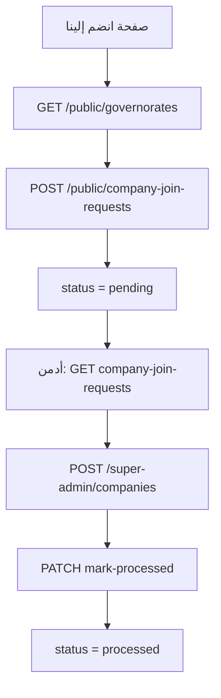

# Watafl — انضم إلينا (Company Join Requests)


**Base URL:** `/api`

> **مهم:** إرسال الطلب **لا ينشئ حساب شركة**.  
> الأدمن يراجع الطلب ثم ينشئ الحساب يدويًا من `POST /super-admin/companies`، وبعدها يعلّم الطلب `processed`.

---

## الفكرة باختصار

| دور | ماذا يفعل؟ |
|-----|------------|
| **زائر (Public)** | يملأ فورم «انضم إلينا» بدون تسجيل |
| **سوبر أدمن** | يشوف الطلبات → ينشئ الشركة يدويًا → يعلّم الطلب معالَج |

---

## الحالات (status)

| قيمة | المعنى |
|------|--------|
| `pending` | طلب جديد في الـ Inbox |
| `processed` | الأدمن خلّص منه (بعد إنشاء الحساب عادةً) |

---

## تدفق الشاشات



### شاشات مقترحة

1. **فرونت عام — انضم إلينا** → فورم + `POST /public/company-join-requests`
2. **أدمن — قائمة الطلبات** → `GET /super-admin/company-join-requests?status=pending`
3. **أدمن — تفاصيل** → `GET .../{id}`
4. **أدمن — إنشاء شركة** → `POST /super-admin/companies` (من بيانات الطلب)
5. **أدمن — تعليم معالَج** → `PATCH .../mark-processed`

---

## شكل العنصر الموحّد

```ts
interface CompanyJoinRequest {
  id: number;
  company_name: string;
  tax_number: string;
  governorate_id: number;
  governorate: {
    id: number;
    name_ar: string;
    name_en: string;
  } | null;
  contact_name: string;
  phone: string;
  email: string;
  notes: string | null;
  status: "pending" | "processed";
  admin_notes: string | null;
  processed_at: string | null;
  processor: {
    id: number;
    name: string;
    email: string;
  } | null;
  created_at: string;
  updated_at: string;
}
```

---

## 1) Public — إرسال طلب

### `POST /public/company-join-requests`

**Auth:** لا

#### Body

| Field | مطلوب | ملاحظات |
|-------|--------|---------|
| `company_name` | نعم | اسم الشركة |
| `tax_number` | نعم | فريد؛ مش موجود في `companies` ولا طلب `pending` بنفس الرقم |
| `governorate_id` | نعم | من `GET /public/governorates` |
| `contact_name` | نعم | اسم المسؤول |
| `phone` | نعم | مش مكرّر في طلب `pending` |
| `email` | نعم | |
| `notes` | لا | max 1000 |

```json
{
  "company_name": "شركة النور للفلاتر",
  "tax_number": "TAX-JOIN-001",
  "governorate_id": 1,
  "contact_name": "أحمد محمد",
  "phone": "01000000001",
  "email": "join@example.com",
  "notes": "نرغب في الانضمام لمنصة واتفل"
}
```

#### Response `201`

```json
{
  "message": "تم استلام طلب الانضمام بنجاح، وسيتواصل معكم فريق واتفل قريبًا",
  "data": {
    "id": 1,
    "company_name": "شركة النور للفلاتر",
    "tax_number": "TAX-JOIN-001",
    "governorate_id": 1,
    "governorate": {
      "id": 1,
      "name_ar": "القاهرة",
      "name_en": "Cairo"
    },
    "contact_name": "أحمد محمد",
    "phone": "01000000001",
    "email": "join@example.com",
    "notes": "نرغب في الانضمام لمنصة واتفل",
    "status": "pending",
    "admin_notes": null,
    "processed_at": null,
    "processor": null,
    "created_at": "2026-07-26 12:00:00",
    "updated_at": "2026-07-26 12:00:00"
  }
}
```

#### أخطاء شائعة `422`

| سبب | الرسالة تقريبًا |
|-----|------------------|
| رقم ضريبي موجود كشركة أو طلب معلّق | الرقم الضريبي مسجّل بالفعل أو يوجد طلب انضمام معلّق بنفس الرقم |
| هاتف عليه طلب `pending` | يوجد طلب انضمام معلّق بنفس رقم الهاتف |
| محافظة غلط | المحافظة غير موجودة |

---

## 2) Super Admin — Inbox

**Auth:** `Bearer {{admin_token}}`

### `GET /super-admin/company-join-requests`

#### Query

| Param | وصف |
|-------|-----|
| `status` | `pending` \| `processed` |
| `q` | بحث: اسم شركة / رقم ضريبي / هاتف / إيميل / اسم المسؤول |
| `page` | |
| `per_page` | افتراضي 15، max 100 |

```http
GET /api/super-admin/company-join-requests?status=pending&q=&page=1&per_page=15
```

#### Response `200`

```json
{
  "data": [ /* CompanyJoinRequest[] */ ],
  "meta": {
    "total": 1,
    "current_page": 1,
    "last_page": 1,
    "per_page": 15
  }
}
```

### `GET /super-admin/company-join-requests/{id}`

تفاصيل طلب واحد — نفس شكل العنصر داخل `data`.

### `PATCH /super-admin/company-join-requests/{id}/mark-processed`

بعد ما الأدمن ينشئ الشركة يدويًا.

#### Body (اختياري)

```json
{
  "admin_notes": "تم إنشاء الحساب يدويًا"
}
```

#### Response `200`

```json
{
  "message": "تم تعليم الطلب كمعالَج",
  "data": {
    "id": 1,
    "status": "processed",
    "admin_notes": "تم إنشاء الحساب يدويًا",
    "processed_at": "2026-07-26 13:00:00",
    "processor": {
      "id": 1,
      "name": "Super Admin",
      "email": "admin@watafl.com"
    }
  }
}
```

#### `422`

لو الطلب مش `pending`: `هذا الطلب تمت معالجته مسبقًا`

---

## 3) إنشاء الشركة يدويًا (بعد المراجعة)

### `POST /super-admin/companies`

انسخ من الطلب:

| من الطلب | إلى إنشاء الشركة |
|----------|------------------|
| `company_name` | `name` |
| `tax_number` | `tax_number` |
| `governorate_id` | `governorate_id` |
| — | `password` (يحدده الأدمن) |
| — | `is_active` / `logo` اختياري |

```json
{
  "name": "شركة النور للفلاتر",
  "tax_number": "TAX-JOIN-001",
  "password": "Company@1234",
  "governorate_id": 1,
  "is_active": true
}
```

ثم الشركة تدخل بـ: `POST /company/login` (`tax_number` + `password`).

---

## Checklist فرونت

**صفحة انضم إلينا**
- [ ] جلب المحافظات
- [ ] فورم بالحقول المطلوبة
- [ ] عرض رسالة نجاح بعد `201`
- [ ] معالجة أخطاء `422` على الحقول

**لوحة الأدمن**
- [ ] تبويب/فلتر `pending` vs `processed`
- [ ] بحث `q`
- [ ] تفاصيل الطلب + بيانات التواصل
- [ ] زر «إنشاء شركة» يفتح فورم `POST /super-admin/companies` معبّأ
- [ ] زر «تعليم معالَج» بعد الإنشاء

---

## خارج النطاق حاليًا

- إنشاء حساب تلقائي عند الموافقة
- إيميل/SMS إشعارات
- OTP على فورم الانضمام
- Customer auth مطلوب للفورم
